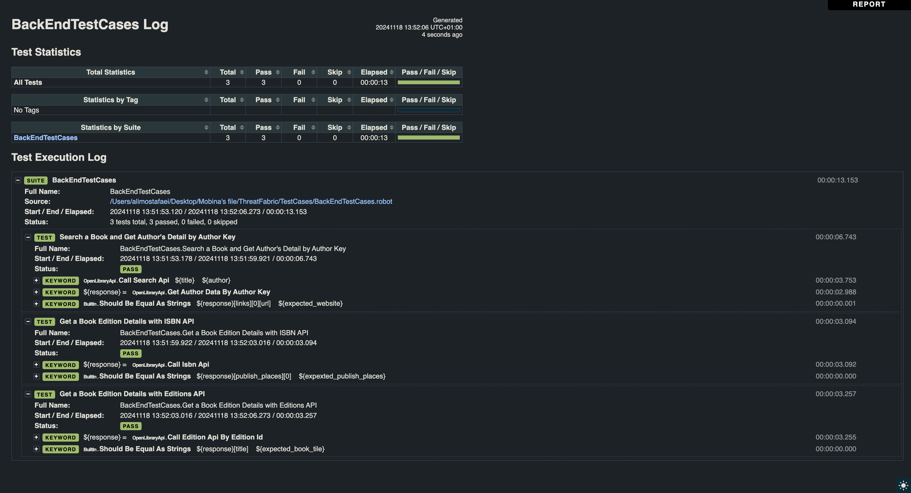

## API Test Automation with Robot Framework & Python Request Library

Before running the tests, ensure that you have the following installed:

- Python (version 3.x)
- pip (Python package manager)
- Robot Framework
- Python Request Library

You can install the required libraries by running the following commands:


**Installation Guide**

Follow these steps to set up the project on your machine:

## 1. Clone the Repository:

    git clone https://github.com/Mobinakadaei/ApiTestCases.git
    cd ApiTestCases

## 2. Install Dependencies:
    pip install robotframework
    pip install requests

## 3. Running the Tests (For API Testing):

   ```sh
   robot BackEndTestCases.robot
   ```

## Test Approach

The API test cases are located in the TestCases/BackEndTestCases.robot folder and are executed after completing the installation steps outlined earlier. I used the Python requests library to handle API requests within OpenLibraryApi.py which is located in the ApiResquests/OpenLibraryApi.py. This Python file is then imported into Robot Framework, allowing its methods to be used as steps in my test cases.

To improve modularity and maintainability, I have used variables file which is located in ApiResquests/variables.py. to store and manage all variables separately. This approach ensures that any changes to variables can be made quickly and efficiently from a single location, making updates seamless and reducing redundancy across the codebase.

I used the Python requests library, although I was able to accomplish this with Robot Framework's request capabilities. Handling requests within Python offers a cleaner, more concise, and easier-to-understand approach for test cases used in Robot Framework. This method enables more modular and maintainable code, as well as simplifying complex logic.

Additionally, I performed assertions such as verifying the response status code directly within the Python file and provided logging for various details, including URLs, status codes, variables, and response bodies. This logging was enhanced through the use of Robot Framework's robot.libraries.BuiltIn library, which offers keywords for interacting with Robot Framework's built-in capabilities, such as logging, and variable handling. Passing variables between methods is also more straightforward using the Python requests library, enhancing code clarity and reducing potential redundancies when compared to Robot Framework’s direct request handling.

## Why Choose Robot Framework with the Python Requests Library for Testing
  For this project, I chose Python requests library and Robot Framework due to their strengths in test automation and suitability for the project's needs. Here are the reasons behind this decision:
   

   **Why Did I Used Python Request Library:**

   * Built-In Assertions and Response Handling:
   The requests library allows you to perform assertions directly within the code. This capability lets you inspect and validate various aspects of the response, such as status codes, headers, and response bodies, all within the same script.

   * Easy Response Handling and Reusability:
   With requests, capturing and passing responses to other methods or functions is simple. This allows seamless data manipulation and reuse, enhancing workflow flexibility and test reusability.

   * Debugging is Easier: 
   Python scripts are usually easier to debug compared to keyword-driven frameworks.

   * Full Control and Flexibility: 
   The requests library allows you to create customized scripts with full control over request headers, authentication, data handling, and more. 

   **Why Did I Used Robot Framework:**

   * Keyword-Driven Testing: 
   Robot Framework supports a keyword-driven approach, which is highly readable and allows even non-technical stakeholders to understand test cases. This makes collaboration and test maintenance easier

   * Built-in Reporting: 
   Robot Framework generates detailed, built-in reports and logs, which helps in quick debugging and test result analysis.(I have included my test report at the beginning of this file to showcase its detailed and comprehensive nature. The report is designed to be easily understood by all team members, whether they have technical or non-technical backgrounds.)

   * Modularity: 
   Robot Framework provides a dedicated mechanism for managing variables, which significantly enhances project modularity and makes it easier to modify test cases when different variables are needed.


## My Project Test Cases:

I have added two additional test cases to this project, and I have outlined the steps below for a clearer understanding.

**TestCase1: Get a Book Edition Details with ISBN API**
| Steps        | Expected Result |
|-------------|-----------------|
|Call search Api and take ISBN number from that and call ISBN Api with the taken number.| API response must be 200 and publish places which is in the ISBN API response must be as expected.|


**TestCase2: Get a Book Edition Details with Editions API**
| Steps        | Expected Result |
|-------------|-----------------|
|Call search Api and take edition id from that and call edition Api with the taken number.| API response must be 200 and book title which is in the Editions API response must be as expected.|


